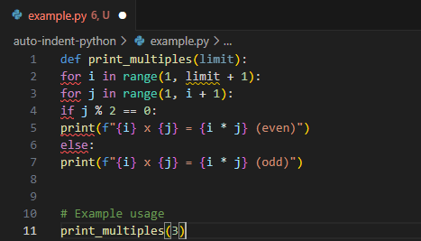

# Auto Indent Paste - VSCode Extension

Auto Indent Paste is a Visual Studio Code extension that automatically adjusts indentation when pasting Python code. This helps maintain consistent formatting and improves code readability.

## Features

- Automatically adjusts indentation on selected Python code.
    * Code without empty lines between will be indented once.
    * Code with one empty line will maintain the indentation level.
    * Code with two empty lines will reset the indentation.
- Works seamlessly with different indentation levels.
- Improves code formatting and reduces manual indentation fixes.

NOTE: This behavior is subject to the code's intent and should be reviewed by the user.

## How To Use

Select the Python code you want to indent with the cursor and press 'Ctrl + Alt + I'

### Screenshot

## Requirements

This extension does not have any external dependencies. Just install and start using it!

## Extension Settings

This extension contributes the following settings:

- `autoIndentPaste.enable`: Enable/disable this extension.
- `autoIndentPaste.indentationSize`: Set the number of spaces for indentation.

## Known Issues

- Might not work correctly with mixed indentation styles (tabs and spaces together).
- If you encounter any issues, please report them on [GitHub Issues](https://github.com/lauglitch/VSCode-Extensions/issues).

## Release Notes

### 1.0.0

- Initial release of Auto Indent Paste.

---

## Author

Created by **Lauglitch**. Visit my website: [lauglitch.com](https://lauglitch.com)

## Following Extension Guidelines

Ensure that you've read through the extension guidelines and follow the best practices for creating your extension.

- [Extension Guidelines](https://code.visualstudio.com/api/references/extension-guidelines)

## For More Information

- [Visual Studio Code's Extension API](https://code.visualstudio.com/api)
- [Markdown Syntax Reference](https://help.github.com/articles/markdown-basics/)

**Enjoy coding with Auto Indent Paste!** 🚀
